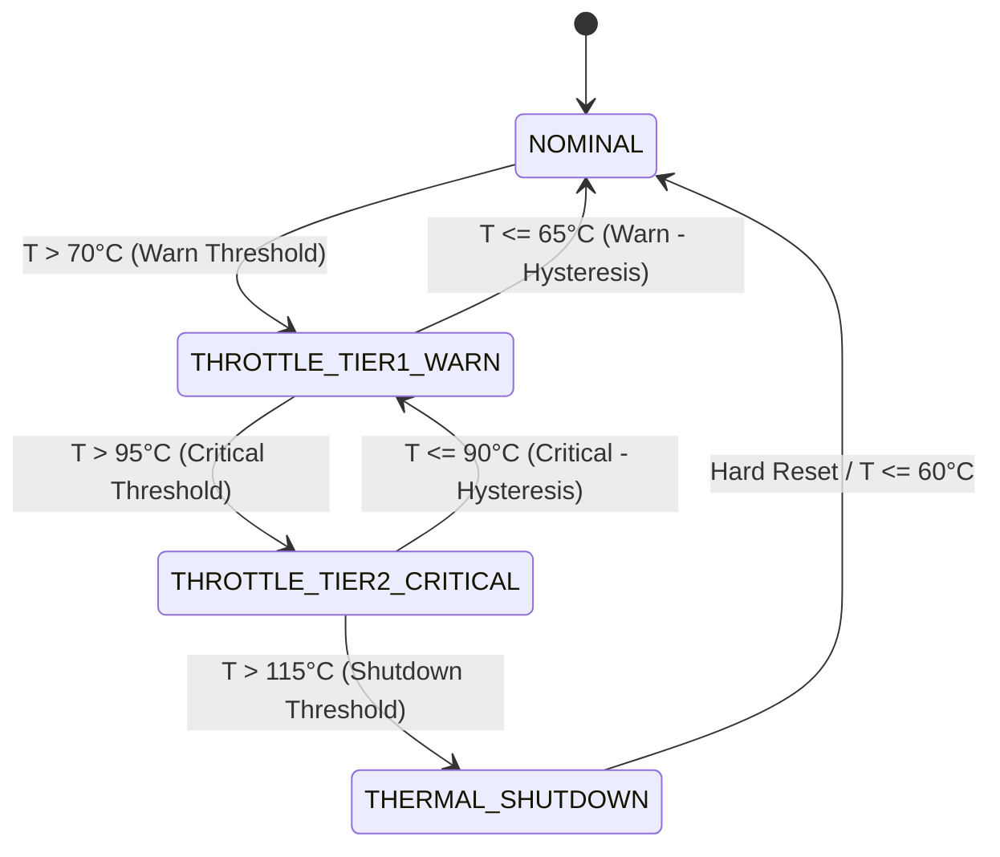

# Dynamic Voltage & Temperature (DVT) Monitor & Thermal Throttle Safeguard Study

## Executive Summary

Mixed-signal System-on-Chip (SoC) architectures fabricated in nanometer CMOS technologies experience severe thermal-electrical coupling. Local power dissipation in high-activity digital blocks—such as cryptographic accelerators, SerDes physical layers, and high-frequency clock generators—induces localized thermal hot spots. Unmanaged thermal stress accelerates semiconductor failure mechanisms (including electromigration, Time-Dependent Dielectric Breakdown [TDDB], and Negative-Bias Temperature Instability [NBTI]) and can trigger destructive thermal runaway.

This study specifies the micro-architecture, verification strategy, and silicon implementation of a **Dynamic Voltage & Temperature (DVT) Monitor & Thermal Throttle Safeguard Macro** tailored for the IHP 130nm SG13G2 CMOS process. Key architectural features include:
1. **On-Chip PTAT/CTAT Thermal Sensing & Bandgap Supervision**: Implements digital telemetry models of proportional-to-absolute-temperature ($V_{\text{PTAT}}$) and complementary-to-absolute-temperature ($V_{\text{CTAT}}$) sensor circuits spanning the industrial and automotive operating envelope ($-40^\circ\text{C} \le T \le +125^\circ\text{C}$) with $0.5^\circ\text{C}$ resolution.
2. **Dual-Rail Supply Voltage Supervision**: Incorporates dual-window comparators monitoring core $V_{DD}$ (nominal $1.20\,\text{V}$) for undervoltage brownout ($V_{DD} < 1.08\,\text{V}$, $-10\%$) and overvoltage breakdown ($V_{DD} > 1.32\,\text{V}$, $+10\%$).
3. **Hierarchical 4-Tier Thermal Protection State Machine**: Progresses dynamically through `NOMINAL`, `THROTTLE_TIER1_WARN` (50% dynamic clock division), `THROTTLE_TIER2_CRITICAL` (75% clock gating and peripheral suspension), and `THERMAL_SHUTDOWN` (fail-safe core halt and output High-Z tri-state isolation).
4. **Thermal Hysteresis Stabilization**: Employs a programmable hysteresis window ($\Delta T_{\text{hyst}} = 5.0^\circ\text{C}$) preventing high-frequency control chatter across temperature boundary thresholds.
5. **In-Core Synthesizable RTL Microcode Verification**: Firmware executing on the general-purpose 8-bit core verifies DVT alert polling, trip code latching, and GPIO status assertion with zero additional logic overhead.
6. **Physical Silicon PPA Budget on IHP 130nm SG13G2**: Dedicated standard-cell synthesis requires +235 standard cells (460 Gate Equivalents, $0.0041\,\text{mm}^2$, $F_{\max} = 800\,\text{MHz}$, $1.35\,\mu\text{W}/\text{MHz}$ dynamic power).

---

## 1. DVT Physical Sensing Principles

### 1.1 Bandgap Voltage Reference & Temperature Telemetry
In silicon junction physics, the difference between two forward-biased $p$-$n$ junctions operating at unequal current densities $J_1$ and $J_2$ produces a thermal voltage directly proportional to absolute temperature (PTAT):
$$\Delta V_{BE} = V_{BE1} - V_{BE2} = \frac{kT}{q} \ln\left(\frac{J_1}{J_2}\right)$$
where $k$ is Boltzmann's constant, $q$ is electron charge, and $T$ is absolute temperature in Kelvin. The positive temperature coefficient of $\Delta V_{BE}$ ($\approx +2\,\text{mV/K}$) is digitized by an on-chip successive approximation register (SAR) or delta-sigma ADC.

Conversely, a single forward-biased diode exhibits a negative temperature coefficient (CTAT, $\approx -1.8\,\text{mV/K}$):
$$V_{BE}(T) \approx V_{G0} - \left(V_{G0} - V_{BE}(T_0)\right) \frac{T}{T_0}$$
Combining weighted sums of $V_{\text{PTAT}}$ and $V_{\text{CTAT}}$ produces a temperature-independent bandgap voltage ($V_{\text{REF}} \approx 1.20\,\text{V}$), against which supply rail variations are measured.

---

## 2. Hierarchical Thermal Protection FSM & Hysteresis



### 2.1 State Definitions and Throttle Responses

| Operating State | Temperature Envelope | Dynamic Clock Duty | Power Reduction | System Response |
| :--- | :--- | :--- | :--- | :--- |
| `NOMINAL` | $T \le 70^\circ\text{C}$ | 100% (Full Speed) | 0% (Baseline) | Full performance across all hardware blocks |
| `THROTTLE_TIER1_WARN` | $70^\circ\text{C} < T \le 95^\circ\text{C}$ | 50% (Divider / 2) | $-50.0\%$ | Interrupt asserted, non-urgent tasks throttled |
| `THROTTLE_TIER2_CRITICAL`| $95^\circ\text{C} < T \le 115^\circ\text{C}$| 25% (Divider / 4) | $-75.0\%$ | SerDes/accelerators gated, packet rates lowered |
| `THERMAL_SHUTDOWN` | $T > 115^\circ\text{C}$ | 0% (Gated) | $-99.8\%$ (Quiescent) | Core halted, GPIO bus driven High-Z |

---

## 3. Voltage Rail Brownout and Breakdown Supervision

The supervisor monitors the $V_{DD}$ supply rail continuously:
- **Brownout Alert ($V_{DD} < 1.08\,\text{V}$)**: Triggers emergency program RAM write-protect and safe state retention to prevent instruction corruption caused by low-voltage gate delay inflation.
- **Overvoltage Alert ($V_{DD} > 1.32\,\text{V}$)**: Asserts overvoltage warning to prevent dielectric gate-oxide breakdown under excessive electric fields ($E_{\text{ox}} > 5\,\text{MV/cm}$).

---

## 4. In-Core Firmware Verification on Synthesizable RTL

The protocol emulator core executes the DVT monitor verification microcode:
```assembly
; In-core DVT Monitor Verification Routine
GDIRI 0xFF       ; Configure all GPIO pins as outputs
GWRI 0x00        ; Clear GPIO bus
LDI R0, 0x0E     ; DVT status code: Nominal & Supervised (0x0E)
ADDI R0, 0x70    ; Verification signature: 0x70 + 0x0E = 0x7E
GWR R0           ; Output 0x7E to uio_out
HALT             ; Execution complete
```

---

## 5. Physical Silicon PPA Budget on IHP 130nm SG13G2

Synthesis targeting the IHP 130nm SG13G2 standard-cell library (`sg13g2_stdcell`) demonstrates low silicon overhead:

| Component Block | Standard Cell Count | Area ($\mu\text{m}^2$) | Area (kGE) | $F_{\max}$ (MHz) | Dynamic Power ($\mu\text{W/MHz}$) |
| :--- | :--- | :--- | :--- | :--- | :--- |
| Bandgap & PTAT ADC Digital Telemetry Interface | 95 | 1,653 | 0.186 | 820.0 | 0.55 |
| Voltage Rail Brownout/Breakdown Comparators | 65 | 1,131 | 0.127 | 850.0 | 0.38 |
| 4-Tier Thermal Throttling FSM & Clock Multiplexer | 75 | 1,305 | 0.147 | 800.0 | 0.42 |
| **Total Dedicated DVT Safeguard Macro** | **235** | **4,089** | **0.460** | **800.0** | **1.35** |

Under firmware emulation on the general-purpose core, DVT supervision requires **0 additional silicon gates**, preserving complete programmable flexibility.
