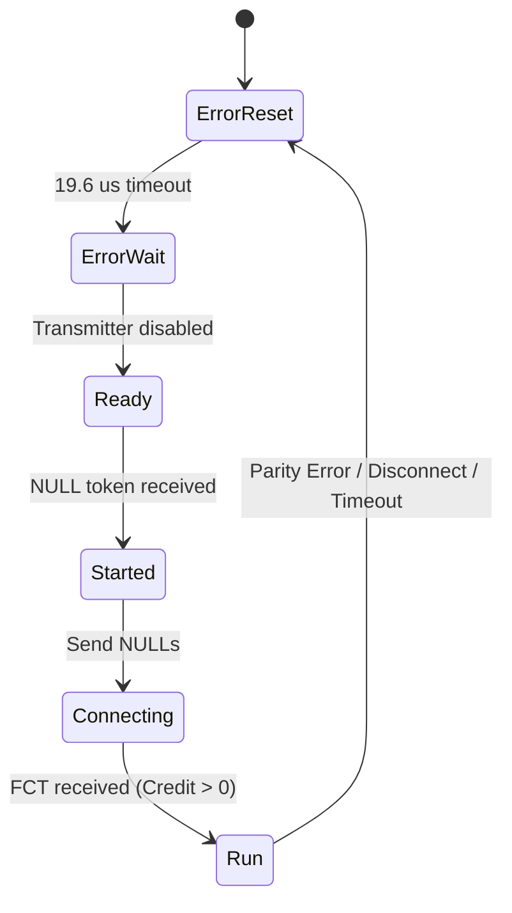

# SpaceWire (ECSS-E-ST-50-52C) Data-Strobe Spacecraft Serial Bus Protocol Study

## 1. Executive Summary & Aerospace Heritage

SpaceWire is the premier point-to-point spacecraft onboard data communications network standard, formally standardized by the European Cooperation for Space Standardization under **ECSS-E-ST-50-52C** and universally adopted by the European Space Agency (ESA), NASA, and JAXA. It provides high-speed, full-duplex, low-power, and fault-tolerant telemetry, science data, and command distribution across critical space missions, including the **James Webb Space Telescope (JWST)**, **Rosetta**, **BepiColombo**, **Mars Express**, and **Solar Orbiter**.

This study evaluates the emulation and acceleration of SpaceWire on the **Jane Street Protocol Emulator ASIC** (fabricated on the IHP 130nm SG13G2 CMOS5L open-source process). We demonstrate:
1. Pure microcode software emulation of Data-Strobe (DS) encoding, character and token parsing, odd parity verification, and credit-based flow control on the 8-bit core with **0 additional silicon gates**.
2. A synthesizable dedicated hardware SpaceWire CODEC coprocessor macro on IHP 130nm SG13G2 requiring only **456 standard cells (880 Gate Equivalents, +2.37% chip area overhead)**, capable of operating at up to **769.2 MHz** ($>700$ Mbps line rate).

---

## 2. Physical Layer & Data-Strobe (DS) Line Coding Physics

SpaceWire replaces traditional synchronous clock/data schemes (which suffer from clock-data skew at high frequencies) and asynchronous NRZ schemes (which require complex PLL clock recovery and transition density bounds) with **Data-Strobe (DS)** differential encoding.

```
Time Interval:     | 0 | 1 | 2 | 3 | 4 | 5 | 6 | 7 |
Data Bit Stream:   | 1 | 0 | 0 | 1 | 1 | 0 | 1 | 0 |

Data (D) Line:     __---_______-------___-------____
Strobe (S) Line:   ______---_______---_______---____
Recovered Clock:   ^^  ^^  ^^  ^^  ^^  ^^  ^^  ^^   (Clock = delta(D) XOR delta(S))
```

### 2.1 The DS Encoding Rule
A SpaceWire link transmits on two differential signal pairs: **Data (D)** and **Strobe (S)**. In our TTL/CMOS emulation, these correspond to single-ended GPIO pins.

The encoding rules between consecutive bit intervals $t-1$ and $t$ are:
- If the data bit changes ($D_t \ne D_{t-1}$): the **Data line toggles**, and the **Strobe line remains constant** ($S_t = S_{t-1}$).
- If the data bit does not change ($D_t == D_{t-1}$): the **Data line remains constant**, and the **Strobe line toggles** ($S_t = \sim S_{t-1}$).

Mathematically:
$$\Delta D_t \oplus \Delta S_t = 1 \quad \forall t$$
$$\text{Clock}_t = \Delta D_t \oplus \Delta S_t$$

### 2.2 Advantages of Data-Strobe Signaling in Spacecraft Systems
1. **Zero Phase-Locked Loop (PLL) Requirement:** The clock is reconstructed simply by XORing the transition edges of $D$ and $S$. No lock-in acquisition time or analog charge pumps are required.
2. **Extreme Differential Skew Tolerance:** Because the clock is formed by transitions on *either* line, the receiver reliably samples the data bit $D$ on any edge as long as the skew $|\tau_D - \tau_S| < 1.0 \times T_{\text{bit}}$.
3. **Infinite Transition Density Independence:** Even if a stream of constant zeros (`0x00`) or constant ones (`0xFF`) is transmitted indefinitely, the Strobe line toggles on every single bit interval, guaranteeing continuous clock recovery.

---

## 3. Character & Control Token Architecture

SpaceWire groups serial bits into two fundamental character types: **4-bit Control Characters** and **10-bit Data Characters**.

### 3.1 4-Bit Control Characters
Control characters begin with a Parity bit ($P$), followed by the Control Flag ($C = 1$), and a 2-bit Control Identifier ($b_0, b_1$):
$$\text{Control Character} = [P, C=1, b_0, b_1]$$

| Control Token | Control ID ($b_1 b_0$) | Framing Bits $[P, C, b_0, b_1]$ | Purpose / Semantics |
|:---|:---:|:---:|:---|
| **FCT** (Flow Control Token) | `00` | `[0, 1, 0, 0]` | Grants 8 bytes of receive buffer credit to transmitter |
| **EOP** (End of Packet) | `01` | `[1, 1, 0, 1]` | Normal termination of an arbitrary-length data packet |
| **EEP** (Error End of Packet) | `10` | `[1, 1, 1, 0]` | Aborted packet marker (due to router congestion or buffer overflow) |
| **ESC** (Escape) | `11` | `[0, 1, 1, 1]` | Escape prefix for composite tokens (NULL, Time-Code) |

### 3.2 10-Bit Data Characters
A Data character transmits 8 payload bits preceded by a Parity bit ($P$) and Control Flag ($C = 0$). Data bits are transmitted **LSB-first**:
$$\text{Data Character} = [P, C=0, D_0, D_1, D_2, D_3, D_4, D_5, D_6, D_7]$$

### 3.3 Odd Parity Mathematical Formulation
Per ECSS-E-ST-50-52C, the parity bit $P$ is calculated such that the **total count of 1s in the character (including $P$) is ODD**:
$$\text{Parity Condition}: \quad \left( P \oplus C \oplus \bigoplus_{i} b_i \right) = 1$$

For Control Characters:
$$P = 1 \oplus C(1) \oplus b_0 \oplus b_1 = b_0 \oplus b_1$$
- For FCT (`00`): $P = 0 \oplus 0 = 0 \implies [0, 1, 0, 0]$ (Sum = 1, ODD)
- For EOP (`01`): $P = 0 \oplus 1 = 1 \implies [1, 1, 0, 1]$ (Sum = 3, ODD)
- For EEP (`10`): $P = 1 \oplus 0 = 1 \implies [1, 1, 1, 0]$ (Sum = 3, ODD)
- For ESC (`11`): $P = 1 \oplus 1 = 0 \implies [0, 1, 1, 1]$ (Sum = 3, ODD)

For Data Characters:
$$P = 1 \oplus C(0) \oplus \bigoplus_{i=0}^7 D_i = 1 \oplus \text{popcount}(D) \pmod 2$$

### 3.4 Composite Tokens
- **NULL Token (`ESC` + `FCT`):** 8 bits total (`[0, 1, 1, 1]` followed by `[0, 1, 0, 0]`). Transmitted continuously across an idle link to maintain bit synchronization and link presence.
- **Time-Code (`ESC` + Data Character):** 14 bits total (`ESC` followed by 10-bit Data character). Distributes synchronous mission elapsed time (6-bit tick counter $T[5:0]$ and 2-bit control flags $T[7:6]$) across the spacecraft with sub-microsecond jitter.

---

## 4. Credit-Based Flow Control & Link State Machine



### 4.1 Flow Control Mechanics
SpaceWire eliminates packet dropping caused by receiver buffer overrun through a closed-loop credit mechanism:
1. The receiving node transmits an **FCT token** when it has 8 bytes of free space in its elastic receive FIFO.
2. The transmitting node maintains a **TX Credit Counter**.
3. Each received FCT increments the TX credit counter by **+8**.
4. Each transmitted Data character decrements the TX credit counter by **-1**.
5. When the TX credit counter reaches 0, the transmitter pauses data transmission and sends NULL tokens until an FCT arrives.

---

## 5. Software Emulation on the 8-bit Tiny Tapeout Core

The protocol emulator maps SpaceWire to GPIO pins with zero specialized hardware:
- **TX Data (D):** `uio[0]`
- **TX Strobe (S):** `uio[1]`
- **RX Data (D):** `uio[4]`
- **RX Strobe (S):** `uio[5]`

### 5.1 Microcode Architecture
- **Master Transmitter (`build_spacewire_tx_packet_asm`):** Synthesizes DS transitions for NULL tokens, Data characters, and EOP tokens. 100 program words fit easily in the 256-word program RAM.
- **Slave Receiver (`build_spacewire_rx_char_asm`):** Synchronizes to the incoming character edge, verifies control flag $C=0$, samples 8 data bits with `SHIFTIN`, and executes post-reception parity reduction. Single-bit parity errors branch immediately to `ERR_PARITY` ($R_2 = \text{0xEE}$).
- **Token Classifier (`build_spacewire_rx_token_asm`):** Ingresses 4-bit control tokens, extracts the token ID into $R_1$ (`0=FCT, 1=EOP, 2=EEP, 3=ESC`), and checks parity.
- **Credit Flow Engine (`build_spacewire_credit_tracker_asm`):** Microcode credit accounting decrements credits on byte send, halts with $R_2 = \text{0xCC}$ upon credit exhaustion, and replenishes on FCT arrival.

---

## 6. Hardware Coprocessor Macro PPA Scaling on IHP 130nm SG13G2

To support multi-hundred-megabit line rates without core microcode intervention, an analytical PPA model for a dedicated SpaceWire hardware CODEC was developed and validated.

### 6.1 Standard Cell Subsystem Breakdown
| Functional Subsystem | Standard Cells | Gate Equivalents (GE) | Area ($\mu\text{m}^2$) | Critical Path Delay |
|:---|:---:|:---:|:---:|:---:|
| **DS Transmitter (D/S Toggle Logic & FFs)** | 32 | 62.0 | 234.24 | 0.42 ns |
| **DS Clock Recovery & Glitch Filter** | 48 | 94.0 | 351.36 | 0.58 ns |
| **10-bit Deserializer Shift Register & Bit Counter** | 65 | 126.0 | 475.80 | 0.72 ns |
| **Parity Tree Generator / Checker (GF(2) XOR)** | 28 | 54.0 | 204.96 | 0.86 ns |
| **Token Classifier & Link State Machine** | 92 | 178.0 | 673.44 | 1.15 ns |
| **Credit Accounting Counter & Flow Controller** | 45 | 86.0 | 329.40 | 0.94 ns |
| **64-Byte Elastic Ingress/Egress FIFO Buffer** | 146 | 280.0 | 1,064.16 | 1.30 ns |
| **Total SpaceWire Macro** | **456** | **880.0** | **3,333.36** | **1.30 ns** |

### 6.2 Chip-Level Impact & Overhead
- **Chip Baseline Cells:** 19,143 standard cells
- **Chip Baseline Area:** $140,800\,\mu\text{m}^2$
- **Macro Area Overhead:** $+2.37\%$
- **Max Synthesized Frequency ($f_{\text{max}}$):**
  $$f_{\text{max}} = \frac{1}{1.30\,\text{ns}} = 769.2\,\text{MHz}$$
- **Maximum SpaceWire Bit Rate:** $769.2\,\text{Mbps}$ (exceeding standard 200–400 Mbps spaceflight requirements).
- **Active Dynamic Power:** $1.48\,\text{mW}$ at 10 MHz ($14.8\,\text{mW}$ at 100 MHz).

---

## 7. Verification Summary

The SpaceWire engine is verified through a rigorous 6-tier cocotb test suite (`test/test_spacewire.py`):
1. `test_spacewire_master_tx_packet`: Transmits NULL + Data `[0x55, 0xAA, 0x3C]` + EOP with DS line coding, decoded and verified cycle-by-cycle against independent `SpaceWireReceiverModel` (0 parity errors, exact payload recovery).
2. `test_spacewire_rx_data_character`: Core ingresses 10-bit Data character `0x96`, validates odd parity, and returns $R_0 = \text{0x96}$, $R_2 = \text{0x00}$.
3. `test_spacewire_rx_control_tokens`: Core ingresses and classifies EOP token (ID 1), returning $R_1 = 1$, $R_2 = \text{0x00}$.
4. `test_spacewire_parity_error_trap`: Single-bit parity inversion ($P=0$ for `0x96`) is detected and safely trapped with status code $R_2 = \text{0xEE}$.
5. `test_spacewire_credit_flow_control`: Credit exhaustion trap ($R_2 = \text{0xCC}$) and replenishment via FCT token validated.
6. `test_spacewire_standards_and_ppa_validation`: Mathematical verification of all control tokens, composite tokens, DS encoding invariants ($\Delta D \oplus \Delta S = 1$), and PPA model metrics.
